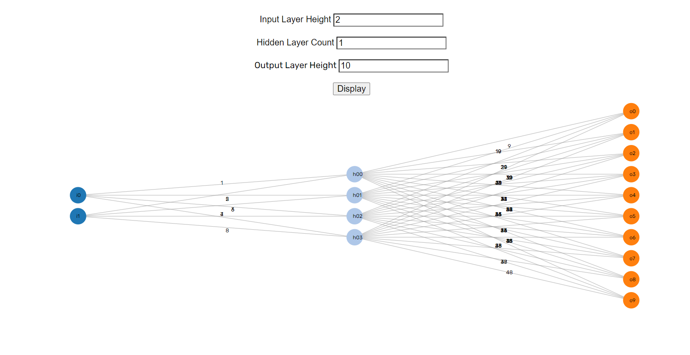
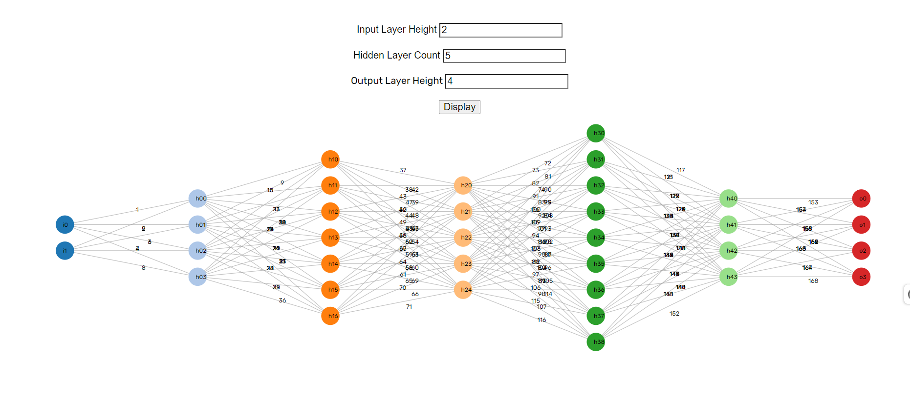

Neural network graphs Documentation
-----------------------------------

App Name : Neural Networks.
1. Development Team :
   * MUGISHA Blaise (Software developer : April 2024 - till date),
   * UWINEZA Bienheureuse (Software developer : April 2024 - till date),

Design Team : MUGISHA Blaise, Uwineza Bienheureuse.

**I) Software requirements**
1) Ubuntu OS 20.04 or higher/Mac OS Monterey12 or higher /Windows OS 10 or 11
2) JDK 17 or higher
3) Tomcat container

**II) IDE**
1) Intellij or Eclipse
   
**III) Hardware requirements**
1) Minimum 4 GB RAM
2) Minimum 12 GB Available Disk Space

**Project Overview:**
The Neural Network Visualization project aims to provide a user-friendly interface for
visualizing neural networks.This project utilizes various technologies such as ZK, JavaScript, and D3.js as a Javascript library for the frontend visualization.

**Project Features:**

* Dynamic Network Graph: The application allows users to input parameters such as input layer height, hidden layer count, and output layer height. Based on these parameters, the neural network graph is dynamically generated and visualized on the frontend.
* Interactive UI: Users can interact with the application through intuitive UI elements such as input fields and buttons  to customize the neural network structure and observe the changes in real-time.

**Technologies Used:**

* ZK: ZK framework is utilized for building the frontend user interface, providing rich and responsive components for a seamless user experience.
* JavaScript: JavaScript is used for client-side scripting to handle dynamic interactions and data manipulation. With the help of D3.js library, it generates interactive and
  dynamic visualizations for the neural network graph.

* Setup Instructions:
To set up and run the project locally, follow these steps:

Clone the project repository from [https://github.com/bienheureuseuwineza/NeuralNetworksGraph].
Install Java Development Kit (JDK) and Apache Maven on your system if not already installed.
Navigate to the project directory and run mvn clean install to build the project.
Deploy the generated WAR file to a servlet container such as Apache Tomcat.
Access the application through the provided URL and start visualizing neural networks!

* You can also run this project on  TomCat Server url:http://localhost:8080/NetworkGraph_war/

* Contributors:

Blaise Mugisha (Software Developer)
Uwineza Bienheureuse (Software Developer)

* Contact Information:
For any inquiries or feedback regarding the project, please contact:

Blaise Mugisha: blaisemugisha1@gmail.com
Uwineza Bienheureuse: bienheureuseuwineza@gmail.com

You can view the pictures below:

